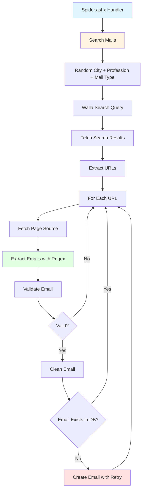
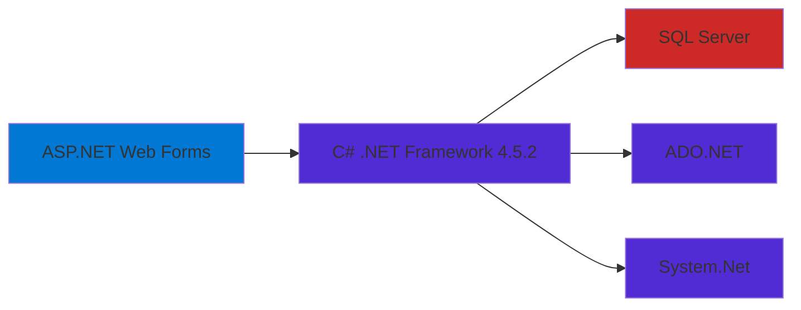

# Cv Spider V4

An automated ASP.NET web scraping application designed to optimize job hunting by scanning online listings.

Built in September 2015, this represents the fourth iteration of the CV Spider platform. The system leverages custom search queries across Walla (powered by Google) to target job postings in specific Israeli cities. It dynamically extracts raw HTML page sources, isolates and validates email addresses, and applies deduplication logic. Unique professional contacts are securely stored in a structured SQL Server database for seamless, automated outreach campaigns.

## Features

### Core Capabilities

- **Automated Web Scraping**: Intelligent scanning of job listings via Walla search engine
- **Email Extraction**: High-precision regex patterns for discovering professional emails
- **Smart Validation**: Multi-stage validation and cleaning of extracted addresses
- **Database Persistence**: Secure SQL Server storage with automated deduplication
- **Hebrew Support**: Native handling of Israeli cities and professional terms
- **Randomized Queries**: Dynamic search parameters to maximize discovery reach

### Technical Excellence

- **Retry Logic**: Robust database operations with automatic failure recovery
- **Clean Architecture**: Separation of concerns between BLL, DAL, and UI layers
- **Performance**: Optimized HTML parsing and URL extraction workflows
- **Data Integrity**: Comprehensive cleaning logic for malformed email addresses
- **Type Safety**: Built with C# and .NET Framework for enterprise reliability

### Developer Experience

- **Visual Studio Integration**: Seamless development with standard .NET tooling
- **Configurable Search**: Easily adjustable city and profession dictionaries
- **Detailed Logging**: Built-in tracking of scraping progress and errors
- **Easy Setup**: Straightforward database and Web.config configuration
- **Structured Codebase**: Well-organized utilities and business logic

- 🔍 Automated web scraping using Walla search engine
- 📧 Email extraction from HTML using regex patterns
- ✅ Comprehensive email validation and cleaning
- 💾 SQL Server database storage with duplicate prevention
- 🔄 Automatic retry logic for database operations
- 🌍 Hebrew language support (cities and professions)
- 🎯 Randomized search queries for varied results
- 📊 Built-in logging capabilities

## Architecture



## Technology Stack



## Getting Started

### Prerequisites

- **.NET Framework** 4.5.2 or higher
- **Visual Studio** 2013 or higher
- **SQL Server** (Express, Standard, or Enterprise)
- **IIS Express** (included with Visual Studio) or IIS

### Installation

1. Clone the repository:

   ```bash
   git clone https://github.com/orassayag/cv-spider-v4.git
   cd cv-spider-v4
   ```

2. Open in Visual Studio:

   ```bash
   # Open the .csproj file in Visual Studio
   CVSpider.csproj
   ```

3. Restore NuGet packages:
   - Visual Studio will automatically prompt to restore packages
   - Or manually: Right-click solution → Restore NuGet Packages

4. Configure database:
   - Update connection string in `Web.config`
   - Create database and required tables
   - Deploy stored procedures

### Database Setup

Create the following table:

```sql
CREATE TABLE Emails (
    Id INT IDENTITY(1,1) PRIMARY KEY,
    Email VARCHAR(255) NOT NULL UNIQUE,
    CreatedDate DATETIME NOT NULL DEFAULT GETDATE()
)
```

Create required stored procedures:

```sql
CREATE PROCEDURE dbo.CreateEmail
    @Email VARCHAR(255)
AS
BEGIN
    IF NOT EXISTS (SELECT 1 FROM Emails WHERE Email = @Email)
    BEGIN
        INSERT INTO Emails (Email, CreatedDate)
        VALUES (@Email, GETDATE())
    END
END

CREATE PROCEDURE dbo.GetEmail
    @Email VARCHAR(255)
AS
BEGIN
    SELECT Email, CreatedDate
    FROM Emails
    WHERE Email = @Email
END
```

### Configuration

Update `Web.config` with your database connection:

```xml
<connectionStrings>
  <add name="MainDB"
       connectionString="Server=YOUR_SERVER;Database=YOUR_DATABASE;User Id=YOUR_USER;Password=YOUR_PASSWORD;"
       providerName="System.Data.SqlClient" />
</connectionStrings>
```

### Running

1. Press F5 in Visual Studio to start debugging
2. Navigate to `http://localhost:PORT/Spider.ashx`
3. The spider will begin searching and extracting emails

## Usage

### Running the Spider

The main entry point for the spider is the `Spider.ashx` handler. Once the application is running, you can trigger the scraping process by navigating to:

```
http://localhost:PORT/Spider.ashx
```

### Modes of Operation

- **Search Mode**: The spider will randomly select parameters and begin scanning for new emails.
- **Print Mode**: Displays the results of the latest scan without performing new searches.

## Available Scripts

While primarily a web application, the project includes several key components that act as automated "scripts":

- **Spider.ashx**: The primary execution script for the web crawler.
- **Database Setup**: SQL scripts for initializing the `Emails` table and stored procedures.
- **Retry Logic**: Automated recovery scripts embedded in the DAL for database stability.

## Best Practices

- **Rate Limiting**: Always implement delays between requests to avoid being blocked by search engines.
- **Data Validation**: Use the `TextUtils` class to ensure only high-quality email addresses are stored.
- **Error Handling**: Monitor the logs for any recurring scraping failures or database connection issues.
- **Database Maintenance**: Periodically review the `Emails` table for any potential duplicate entries that bypassed validation.

## Development

### Building the Project

The project uses standard .NET build tools. You can build it using Visual Studio or MSBuild:

```bash
# Using MSBuild
msbuild CVSpider.csproj /p:Configuration=Release
```

### Testing

Manual testing can be performed by:

1. Triggering the `Spider.ashx` handler.
2. Verifying email extraction results in the database.
3. Checking the log files for any reported errors.

## Architecture Principles

This project adheres to several core architecture principles:

1. **Separation of Concerns**: Distinct layers for business logic (BLL), data access (DAL), and utilities.
2. **Reliability**: Automated retry mechanisms for database operations to handle transient failures.
3. **Extensibility**: Easy to add new cities, professions, or email patterns via specialized classes.
4. **Validation-First**: All extracted data undergoes rigorous cleaning and validation before persistence.

## Design Patterns

- **Repository Pattern**: Abstracted data access via `DAL.cs` and `DbUtilsDal.cs`.
- **Utility Pattern**: Centralized string manipulation and scraping logic in `TextUtils.cs`.
- **Data Transfer Object (DTO)**: `EmailRow.cs` for structured data movement.
- **Handler Pattern**: Using `IHttpHandler` for lightweight, request-driven execution.

## Directory Structure

```
cv-spider-v4/
├── Code/                   # Core business logic and utilities
│   ├── BLL.cs              # Business Logic Layer
│   ├── DAL.cs              # Data Access Layer
│   └── ...                 # Specialized utility classes
├── Properties/             # Assembly metadata
├── Spider.ashx             # Main handler entry point
├── Web.config              # Main configuration file
└── CVSpider.csproj         # Visual Studio project file
```

## Project Structure

```
cv-spider-v4/
├── Code/
│   ├── BLL.cs                  # Business Logic Layer
│   ├── DAL.cs                  # Data Access Layer
│   ├── Cities.cs               # Israeli cities list
│   ├── Professions.cs          # Job positions list
│   ├── MailTypes.cs            # Email type patterns
│   ├── TextUtils.cs            # Web scraping & validation utilities
│   ├── DbUtilsDal.cs           # Database utilities
│   └── EmailRow.cs             # Email data model
├── Properties/
│   └── AssemblyInfo.cs         # Assembly metadata
├── Spider.ashx                 # HTTP handler entry point
├── Spider.ashx.cs              # Main spider logic
├── Web.config                  # Application configuration
├── Web.Debug.config            # Debug configuration
├── Web.Release.config          # Release configuration
├── CVSpider.csproj             # Visual Studio project file
└── packages.config             # NuGet packages configuration
```

## How It Works

### Search Flow

1. **Query Generation**: Randomly selects a city, profession, and mail type to create a search query
2. **Web Scraping**: Fetches search results from Walla search (10 pages)
3. **URL Extraction**: Parses HTML to extract relevant URLs
4. **Email Discovery**: Visits each URL and searches for email addresses using regex
5. **Validation**: Validates email format and structure
6. **Cleaning**: Fixes common typos and formatting issues
7. **Storage**: Saves unique emails to database with retry logic

### Email Validation

The spider performs comprehensive email validation:

- ✅ Must contain `@` symbol
- ✅ Both local and domain parts must be > 2 characters
- ✅ Proper domain format validation
- ✅ Rejects image file extensions (.jpg, .png)
- ✅ Rejects malformed addresses (double dots, invalid dashes)
- ✅ Uses `MailAddress` class for final validation

### Email Cleaning

Automatically fixes common issues:

- Removes special characters (`/`, `\`, `!`, `?`, etc.)
- Fixes domain typos (`.con` → `.com`, `.coil` → `.co.il`)
- Removes mailto: prefixes
- Fixes double dots and spaces
- Normalizes domain extensions

## Built With

- [ASP.NET Web Forms](https://www.asp.net/web-forms) - Web framework
- [.NET Framework 4.5.2](https://dotnet.microsoft.com/) - Runtime framework
- [SQL Server](https://www.microsoft.com/sql-server) - Database
- [ADO.NET](https://docs.microsoft.com/en-us/dotnet/framework/data/adonet/) - Data access
- [C#](https://docs.microsoft.com/en-us/dotnet/csharp/) - Programming language

## Contributing

Contributions to this project are [released](https://help.github.com/articles/github-terms-of-service/#6-contributions-under-repository-license) to the public under the [project's open source license](LICENSE).

Everyone is welcome to contribute. Contributing doesn't just mean submitting pull requests—there are many different ways to get involved, including answering questions, reporting issues, improving documentation, or suggesting new features.

Please read [CONTRIBUTING.md](CONTRIBUTING.md) for details on our code of conduct and the process for submitting pull requests.

## Versioning

We use [SemVer](http://semver.org/) for versioning. For the versions available, see the [tags on this repository](https://github.com/orassayag/cv-spider-v4/tags).

## Support

For questions, issues, or contributions:

- **GitHub Issues**: [https://github.com/orassayag/cv-spider-v4/issues](https://github.com/orassayag/cv-spider-v4/issues)
- **Email**: orassayag@gmail.com

## Author

- **Or Assayag** - _Initial work_ - [orassayag](https://github.com/orassayag)
- Or Assayag <orassayag@gmail.com>
- GitHub: https://github.com/orassayag
- StackOverflow: https://stackoverflow.com/users/4442606/or-assayag?tab=profile
- LinkedIn: https://linkedin.com/in/orassayag

## License

This application has an MIT license - see the [LICENSE](LICENSE) file for details.

## Acknowledgments

- Built for educational and research purposes
- Respects robots.txt and implements rate limiting
- Uses user-agent rotation to avoid detection
- Implements polite crawling practices

## Disclaimer

This tool is for educational and personal use only. When using web scraping:

- Respect websites' Terms of Service
- Follow robots.txt guidelines
- Implement appropriate rate limiting
- Do not overload target servers
- Ensure compliance with data protection laws (GDPR, etc.)
