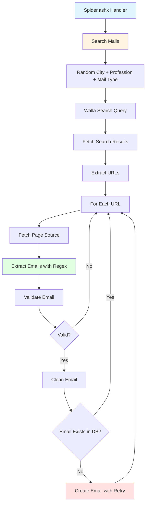
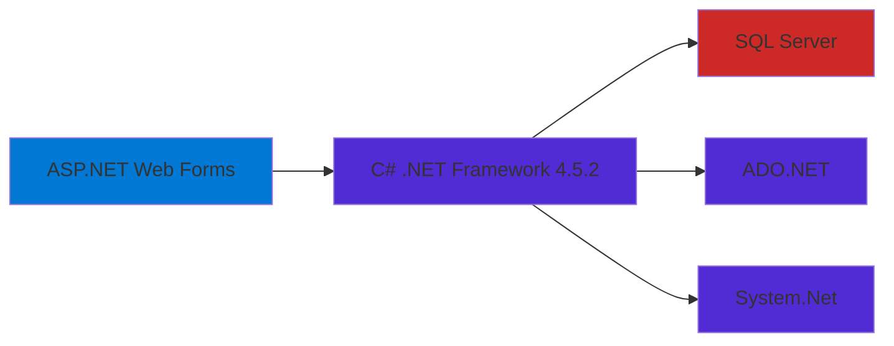

# CV Spider V4

An ASP.NET web scraping application that automatically searches for job postings, extracts email addresses, validates them, and stores unique contacts in a SQL Server database.

Built in September 2015. This is the fourth version of CV Spider that uses Walla search (powered by Google) to find job postings in Israeli cities, extract email addresses from page sources, and automatically store them for job search purposes.

## Features

- 🔍 Automated web scraping using Walla search engine
- 📧 Email extraction from HTML using regex patterns
- ✅ Comprehensive email validation and cleaning
- 💾 SQL Server database storage with duplicate prevention
- 🔄 Automatic retry logic for database operations
- 🌍 Hebrew language support (cities and professions)
- 🎯 Randomized search queries for varied results
- 📊 Built-in logging capabilities

## Architecture



## Technology Stack



## Getting Started

### Prerequisites

- **.NET Framework** 4.5.2 or higher
- **Visual Studio** 2013 or higher
- **SQL Server** (Express, Standard, or Enterprise)
- **IIS Express** (included with Visual Studio) or IIS

### Installation

1. Clone the repository:
   ```bash
   git clone https://github.com/orassayag/cv-spider-v4.git
   cd cv-spider-v4
   ```

2. Open in Visual Studio:
   ```bash
   # Open the .csproj file in Visual Studio
   CVSpider.csproj
   ```

3. Restore NuGet packages:
   - Visual Studio will automatically prompt to restore packages
   - Or manually: Right-click solution → Restore NuGet Packages

4. Configure database:
   - Update connection string in `Web.config`
   - Create database and required tables
   - Deploy stored procedures

### Database Setup

Create the following table:

```sql
CREATE TABLE Emails (
    Id INT IDENTITY(1,1) PRIMARY KEY,
    Email VARCHAR(255) NOT NULL UNIQUE,
    CreatedDate DATETIME NOT NULL DEFAULT GETDATE()
)
```

Create required stored procedures:

```sql
CREATE PROCEDURE dbo.CreateEmail
    @Email VARCHAR(255)
AS
BEGIN
    IF NOT EXISTS (SELECT 1 FROM Emails WHERE Email = @Email)
    BEGIN
        INSERT INTO Emails (Email, CreatedDate)
        VALUES (@Email, GETDATE())
    END
END

CREATE PROCEDURE dbo.GetEmail
    @Email VARCHAR(255)
AS
BEGIN
    SELECT Email, CreatedDate
    FROM Emails
    WHERE Email = @Email
END
```

### Configuration

Update `Web.config` with your database connection:

```xml
<connectionStrings>
  <add name="MainDB" 
       connectionString="Server=YOUR_SERVER;Database=YOUR_DATABASE;User Id=YOUR_USER;Password=YOUR_PASSWORD;" 
       providerName="System.Data.SqlClient" />
</connectionStrings>
```

### Running

1. Press F5 in Visual Studio to start debugging
2. Navigate to `http://localhost:PORT/Spider.ashx`
3. The spider will begin searching and extracting emails

## Project Structure

```
cv-spider-v4/
├── Code/
│   ├── BLL.cs                  # Business Logic Layer
│   ├── DAL.cs                  # Data Access Layer
│   ├── Cities.cs               # Israeli cities list
│   ├── Professions.cs          # Job positions list
│   ├── MailTypes.cs            # Email type patterns
│   ├── TextUtils.cs            # Web scraping & validation utilities
│   ├── DbUtilsDal.cs           # Database utilities
│   └── EmailRow.cs             # Email data model
├── Properties/
│   └── AssemblyInfo.cs         # Assembly metadata
├── Spider.ashx                 # HTTP handler entry point
├── Spider.ashx.cs              # Main spider logic
├── Web.config                  # Application configuration
├── Web.Debug.config            # Debug configuration
├── Web.Release.config          # Release configuration
├── CVSpider.csproj             # Visual Studio project file
└── packages.config             # NuGet packages configuration
```

## How It Works

### Search Flow

1. **Query Generation**: Randomly selects a city, profession, and mail type to create a search query
2. **Web Scraping**: Fetches search results from Walla search (10 pages)
3. **URL Extraction**: Parses HTML to extract relevant URLs
4. **Email Discovery**: Visits each URL and searches for email addresses using regex
5. **Validation**: Validates email format and structure
6. **Cleaning**: Fixes common typos and formatting issues
7. **Storage**: Saves unique emails to database with retry logic

### Email Validation

The spider performs comprehensive email validation:

- ✅ Must contain `@` symbol
- ✅ Both local and domain parts must be > 2 characters
- ✅ Proper domain format validation
- ✅ Rejects image file extensions (.jpg, .png)
- ✅ Rejects malformed addresses (double dots, invalid dashes)
- ✅ Uses `MailAddress` class for final validation

### Email Cleaning

Automatically fixes common issues:

- Removes special characters (`/`, `\`, `!`, `?`, etc.)
- Fixes domain typos (`.con` → `.com`, `.coil` → `.co.il`)
- Removes mailto: prefixes
- Fixes double dots and spaces
- Normalizes domain extensions

## Built With

* [ASP.NET Web Forms](https://www.asp.net/web-forms) - Web framework
* [.NET Framework 4.5.2](https://dotnet.microsoft.com/) - Runtime framework
* [SQL Server](https://www.microsoft.com/sql-server) - Database
* [ADO.NET](https://docs.microsoft.com/en-us/dotnet/framework/data/adonet/) - Data access
* [C#](https://docs.microsoft.com/en-us/dotnet/csharp/) - Programming language

## Contributing

Contributions to this project are [released](https://help.github.com/articles/github-terms-of-service/#6-contributions-under-repository-license) to the public under the [project's open source license](LICENSE).

Everyone is welcome to contribute. Contributing doesn't just mean submitting pull requests—there are many different ways to get involved, including answering questions, reporting issues, improving documentation, or suggesting new features.

Please read [CONTRIBUTING.md](CONTRIBUTING.md) for details on our code of conduct and the process for submitting pull requests.

## Versioning

We use [SemVer](http://semver.org/) for versioning. For the versions available, see the [tags on this repository](https://github.com/orassayag/cv-spider-v4/tags).

## Author

* **Or Assayag** - *Initial work* - [orassayag](https://github.com/orassayag)
* Or Assayag <orassayag@gmail.com>
* GitHub: https://github.com/orassayag
* StackOverflow: https://stackoverflow.com/users/4442606/or-assayag?tab=profile
* LinkedIn: https://linkedin.com/in/orassayag

## License

This project is licensed under the MIT License - see the [LICENSE](LICENSE) file for details.

## Acknowledgments

- Built for job search automation in the Israeli market
- Focuses on administrative and secretarial positions
- Supports Hebrew language for cities and professions
- Uses Walla search engine as the data source

## Disclaimer

This tool is for educational and personal use only. When using web scraping:
- Respect websites' Terms of Service
- Follow robots.txt guidelines
- Implement appropriate rate limiting
- Do not overload target servers
- Ensure compliance with data protection laws (GDPR, etc.)
